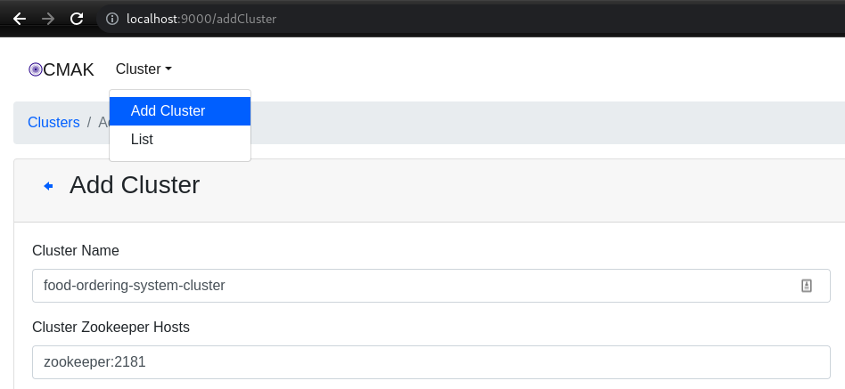
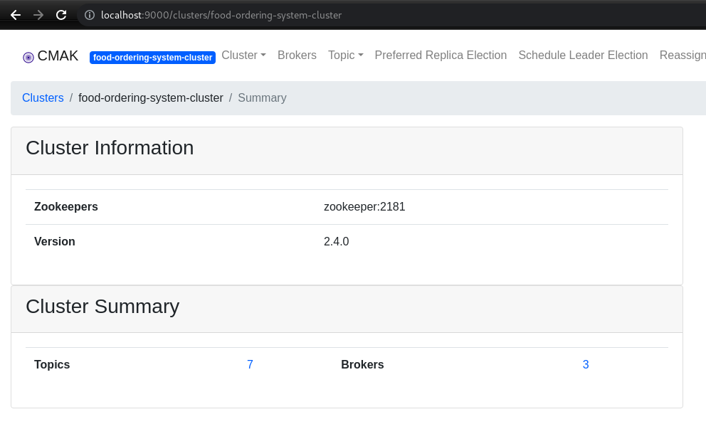

# food-ordering-system


## Run Postgres
```shell
docker run --rm \
--name food-ordering-system-db \
-e POSTGRES_DB=postgres \
-e POSTGRES_USER=postgres \
-e POSTGRES_PASSWORD=admin \
-e PGDATA=/var/lib/postgresql/data/pgdata \
-v "$PWD/postgres-data:/var/lib/postgresql/data" \
-p 5432:5432 \
postgres:15
```

## Create schema and Insert Data
```text
- order-service/order-container/src/main/resources/restaurant-schema.sql
- order-service/order-container/src/main/resources/restaurant-data.sql
```

## Run Zookeper
```shell
# goto directory
cd infrastructure/docker-compose
# run
docker compose -f common.yml -f zookeeper.yml up
# to stop
docker compose -f common.yml -f zookeeper.yml down
# open new terminal test
echo ruok | nc localhost 2181
```
https://zookeeper.apache.org/doc/r3.1.2/zookeeperAdmin.html#sc_zkCommands

## Run Kafka Cluster
```shell
# cd infrastructure/docker-compose
docker compose -f common.yml -f kafka_cluster.yml up
# to stop
docker compose -f common.yml -f kafka_cluster.yml down
# open new terminal and run this for create topic
docker compose -f common.yml -f init_kafka.yml up
```

## Let's confirm this by opening the kafka manager user interface
```http request
localhost:9000
```

## Add Cluster

And save. Now, if I list the clusters, I will see three brokers and a topic created using init-kafka.yml docker compose file


## Check data in topic using kafkacat
```shell
kcat -C -b localhost:19092 -t payment-request
```

##### ingat saat anda menggunakan pemetaan volume, anda harus terlebih dahulu memulai Zookeeper dan kemudian memulai Cluster Kafka, karena kafka cluster memeriksa kesehatan Zookeeper saat startup dan gagal jika tidak sehat
kedepannya saya akan coba menganti docker compose dengan cp-helm-charts dari kubernetes untuk menjalankan Cluster Kafka

## Note
- The main target of all these architectures is to isolate the domain layer to develop, test, manage and deploy it separately.
- SAGA is used to create long running distributed transactions across services.
- Input ports are implemented in the domain layer but is not the adapter itself, whilst output ports are implemented with secondary adapters, with infrastructure modules.
- DIP(dependency inversion principle) leads to loosely coupled systems and an independent domain layer, by inverting any runtime dependency.
- Aggregate: Group of entities that are logically related. 
- Aggregate root: Root entity to keep the aggregate in a consistent state. 
- Entity: Core domain objects. 
- Value object: Used to bring context to the value. 
- Domain Event: Used to decouple the different domains. It will notify the other domains based on result of business logic.
- Value objects are immutable and only holds data, so identifier is not important for them. That means 2 value objects with same data, but different id’s considered to be the same value object.
- Entity classes do not have to be immutable. In fact they have state changes methods to run during business logic
- Application service should be the first contact point to outside of domain, and it will forward the call to the domain service and entities to complete a business logic.
- TransactionalEventListener is a spring annotation that listens an event that is fired from a transactional method. And it only process the event if the transactional operation is completed successfully.
- Kafka provides a replication factor. It replicates the data on different brokers on different servers. So even if one of the brokers is down, the data will still be available on other nodes.
- KafkaTemplate is a spring component that wraps a Kafka Producer and provides method to easily produce data on kafka. 
- To create a Kafka Consumer with spring, using a KafkaListener annotation on a simple method is enough. 
- If my kafka topic has n partitions, I cannot use more than n threads to consume the data on topics. 
- Kafka Consumer has a max poll records property that limits the number of records returned for a single poll.
- ControllerAdvice: Used to catch exceptions application wide. 
- RestController: Used to create a rest controller with path mapping, and accept type. 
- RequestBody: Used to mark a java class as a request body in the rest request. Spring will map the json body into this class by setting the values automatically. 
- PostMapping: Used to create a method that will serve to a http post request.